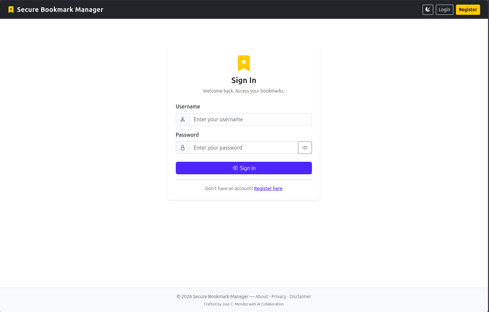
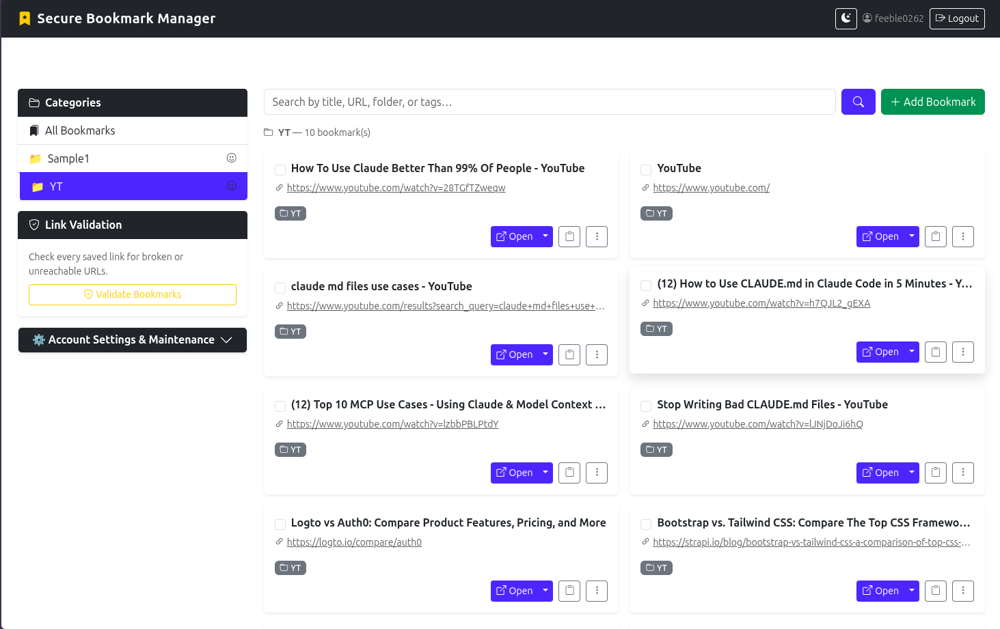
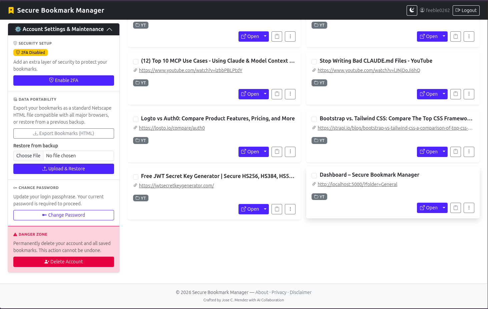

# Secure Bookmark Manager


A self-hosted, containerised bookmark manager built with Flask. Organise URLs into custom emoji-tagged categories, search across your entire collection, and validate link health — all behind a secure login system with optional Time-based Two-Factor Authentication (TOTP).

**Live site:** [bookmark.sandbox99.cc](https://bookmark.sandbox99.cc/)

---

## Screenshots

<table>
  <tr>
    <td align="center"><a href="screenshot/secure-bookmark-manager-login.png" target="_blank"></a><br/><sub>Login</sub></td>
    <td align="center"><a href="screenshot/dashboard-01.png" target="_blank"></a><br/><sub>Dashboard</sub></td>
    <td align="center"><a href="screenshot/dashboard-account-settings.png" target="_blank"></a><br/><sub>Account Settings</sub></td>
  </tr>
</table>

---

## Features

- **User authentication** — login with default admin credentials (admin / Secure-Bookmark-Manager)
- **User management** — admin-only CRUD interface for creating, editing, and deleting user accounts
- **No public registration** — only administrators can create new user accounts
- **Role-based access control** — single admin account with regular user roles
- **Two-factor authentication** — optional TOTP via Google Authenticator, Authy, or any compatible app
- **CSRF protection** — Flask-WTF cross-site request forgery protection on all forms
- **Rate limiting** — built-in rate limiting with stricter limits on login and 2FA endpoints
- **Bookmark CRUD** — add, edit, and delete bookmarks with title, URL, category, tags, and auto-scraped metadata
- **Category organisation** — flat single-level categories with custom emoji icons per category
- **Bulk delete** — multi-select bookmarks for batch deletion from the dashboard
- **Tag support** — attach comma-separated tags to any bookmark
- **Full-text search** — search by title, URL, category, or tags in a single query
- **Link validation** — async background health checker flags broken or unreachable URLs
- **Data portability** — export and import bookmarks as standard Netscape HTML bookmark files
- **Consolidated SQLite database** — single `bookmarks.db` for users, bookmarks, and categories; persisted via a named Docker volume
- **Bootstrap 5 UI** — responsive two-column dashboard, dark mode toggle, accordion sidebar settings panel

---

## Tech Stack

| Layer | Technology |
|---|---|
| Backend | Python 3.11, Flask 3.1.1, Flask-Login 0.6.3 |
| Security | Werkzeug password hashing, PyOTP (TOTP), HIBP breach API, Flask-WTF (CSRF), Flask-Limiter (rate limiting) |
| Database | SQLite3 (consolidated database) |
| Frontend | Jinja2 templates, Bootstrap 5.3.2, Bootstrap Icons 1.11.3 |
| Server | Gunicorn 23 |
| Container | Docker, Docker Compose |
| Async | aiohttp 3.9.5 (link validator) |

---

## Prerequisites

- [Docker](https://docs.docker.com/get-docker/) and [Docker Compose](https://docs.docker.com/compose/install/)

No local Python installation is required.

---

## Quick Start

### Option A: Automated Deployment (Recommended)

**1. Clone the repository**

```bash
git clone https://github.com/msfx07/secure-bookmark-manager.git
cd secure-bookmark-manager
```

**2. Run the deploy script**

```bash
chmod +x deploy.sh
./deploy.sh
```

The script will automatically:
- Check Docker & Docker Compose versions
- Generate a `.env` file with a random `SECRET_KEY` if it doesn't exist
- Initialize the SQLite database schema
- Build and start the containers
- Verify the application is running

**3. Open in your browser**

```
http://localhost:5000
```

**4. Log in with default credentials**

| Field | Value |
|-------|-------|
| Username | `admin` |
| Password | `Secure-Bookmark-Manager` |

> ⚠️ **Important:** Change the default password immediately after first login!

---

## Default Credentials

A default admin account is created automatically on first run:

| Username | Password |
|----------|----------|
| `admin` | `Secure-Bookmark-Manager` |

> **Security Note:** Public registration has been removed. Only administrators can create new user accounts. Change the default password immediately after first login!

---

## User Management

Administrators can manage user accounts through the admin panel:

1. Log in with admin credentials
2. Click the **Users** button in the navigation bar
3. Use the interface to create, edit, or delete user accounts

### User Roles

| Role | Description |
|------|-------------|
| **Admin** | Full access to all features including user management |
| **User** | Standard access to bookmarks and personal settings |

> **Note:** Only the main admin account (username: `admin`) has admin privileges. New users are created with the regular user role and cannot be promoted to admin.

---

## Environment Variables

| Variable | Description | Default |
|---|---|---|
| `SECRET_KEY` | Flask session signing key — **change before deploying** | Auto-generated |
| `BOOKMARK_DB_PATH` | Path to SQLite database | `/app/data/bookmarks.db` |
| `FLASK_DEBUG` | Enable debug mode (`true`/`false`) | `false` |

---

## Data Persistence

Bookmark and user data are stored in SQLite databases at `/app/data/` inside the container. The named Docker volume `bookmark_data` maps to this path, so data survives container restarts and rebuilds.

```bash
# Stop without losing data
docker compose down

# Destroy containers AND wipe all data
docker compose down -v
```

---

## Project Structure

```
secure-bookmark-manager/
├── Dockerfile
├── docker-compose.yml
├── docker-compose.dev.yml
├── requirements.txt
├── deploy.sh                 # Automated deployment script (recommended)
├── app.py                    # App factory, LoginManager, DB init, blueprint registration
├── .dockerignore
├── .env                      # Local secrets (git-ignored)
├── data/                     # Local mirror of Docker volume (git-ignored)
├── models/
│   ├── auth_db.py            # User model, password hashing, TOTP helpers
│   └── bookmark_db.py        # Bookmark CRUD, category list/rename/emoji, search, validation
├── routes/
│   ├── auth.py               # Login, logout, 2FA setup/verify/disable, change-password, delete-account
│   ├── bookmarks.py          # Dashboard, CRUD, export, import, bulk-delete, category icon, link validate
│   └── admin.py              # User management (admin only)
├── services/
│   └── validator.py          # Async link health checker — background daemon + per-user trigger
├── templates/
│   ├── base.html             # Bootstrap layout, navbar, dark mode, flash messages, footer
│   ├── login.html
│   ├── dashboard.html        # Two-column layout, category sidebar, bookmark grid, bulk select
│   ├── edit.html
│   ├── about.html
│   ├── privacy.html
│   ├── disclaimer.html
│   ├── 2fa_setup.html        # QR code + manual key + confirmation form
│   ├── 2fa_verify.html       # Login checkpoint
│   └── admin/
│       ├── users.html        # User list (admin only)
│       ├── create_user.html  # Create user form (admin only)
│       └── edit_user.html    # Edit user form (admin only)
└── static/
    └── css/custom.css
```

---

## Deploy Script

The `deploy.sh` script provides automated deployment with the following features:

### Features

| Feature | Description |
|---------|-------------|
| **Docker Check** | Verifies Docker and Docker Compose are installed |
| **Environment Setup** | Auto-generates `.env` with secure `SECRET_KEY` if missing |
| **Database Init** | Initializes SQLite schema with all required tables |
| **Container Build** | Builds and starts Docker containers |
| **Health Check** | Verifies the application is running correctly |

### Usage

```bash
# Make the script executable (first time only)
chmod +x deploy.sh

# Run the deployment
./deploy.sh
```

### What the Script Does

1. **Validates prerequisites** — Checks for Docker and Docker Compose
2. **Creates `.env` file** — Generates a secure random `SECRET_KEY` if `.env` doesn't exist
3. **Initializes database** — Creates the SQLite schema locally before container startup
4. **Builds containers** — Runs `docker compose up --build -d`
5. **Verifies deployment** — Checks if the application is responding on port 5000


## Seed Demo Users

The `seed_demo_users.py` script creates 3 demo users with 5 bookmarks each for testing purposes.

### Features

| Feature | Description |
|---------|-------------|
| **3 Demo Users** | Creates `alice`, `bob`, and `charlie` with unique passwords |
| **15 Bookmarks** | Each user gets 5 bookmarks across different categories |
| **Role Assignment** | All users created with `user` role (not admin) |
| **Idempotent** | Safe to run multiple times — skips existing users |

### Usage

```bash
# Run the seed script
python3 seed_demo_users.py
```

### Demo Users Created

| Username | Password | Role | Bookmarks |
|----------|----------|------|-----------|
| `alice` | `AliceSecure123!` | user | 5 |
| `bob` | `BobSecure456!` | user | 5 |
| `charlie` | `CharlieSecure789!` | user | 5 |

### Sample Bookmarks per User

| User | Categories |
|------|------------|
| **alice** | Work, Learning, Entertainment, Shopping, Health |
| **bob** | Work, Learning, Entertainment, Shopping, Health |
| **charlie** | Work, Learning, Entertainment, Shopping, Health |

### Example Output

```
============================================================
  DEMO USER SEED SCRIPT
  Creates 3 users with 5 bookmarks each
============================================================

👤 Creating user: alice
  ✓ Created 5 bookmarks in 5 categories

👤 Creating user: bob
  ✓ Created 5 bookmarks in 5 categories

👤 Creating user: charlie
  ✓ Created 5 bookmarks in 5 categories

============================================================
  SUMMARY REPORT
============================================================

Username        Password                  User ID    Bookmarks
------------------------------------------------------------
alice           AliceSecure123!           2          5
bob             BobSecure456!             3          5
charlie         CharlieSecure789!         4          5
------------------------------------------------------------

✅ Total users created: 3
✅ Total bookmarks created: 15
```

---

## Two-Factor Authentication

2FA is **disabled by default** but fully optional. Users can enable it from their account settings.

### Enabling 2FA

1. Log in and open the **Security Setup** panel in the dashboard sidebar.
2. Click **Enable 2FA** and scan the QR code with your authenticator app.
3. Enter the 6-digit code to confirm — 2FA is now active.

### Disabling 2FA

1. Open the **Security Setup** panel in the dashboard sidebar.
2. Click **Disable 2FA** and enter your current TOTP code to confirm.

> **Note:** 2FA is per-user and optional. Each user decides whether to enable it for their account.

---

## Contributing

Pull requests are welcome. For major changes, please open an issue first to discuss what you would like to change.

---

## License

MIT
